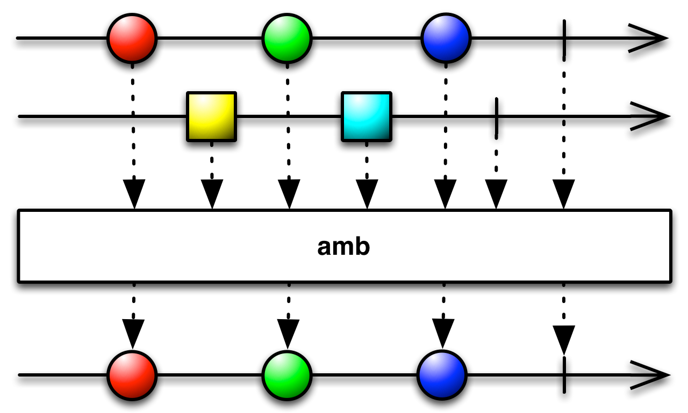

## RxJava操作符

### Observable

### 创建

1. create
2. just
3. from
	1. from
	2. fromArray
	3. fromCallable
	4. fromFuture
	5. fromIterable
	6. fromPublisher
4. defer
5. empty
6. error
7. generate
8. never
9. range
	1. range
	2. rangeLong
10. unsafeCreate
11. using
12. wrap

### 变换

1. map
2. flatMap
3. concatMap

### 过滤

1. filter
2. sample
3. take/takeList
4. distinct
5. amb

传递两个或者多个Observable给amb时, 它只发射处于第一位的Observable的所有数据, 而其他所有的Observable数据将会被丢弃

	1. ambArray
	
			   Observable.ambArray(
							Observable.just(1, 2, 3).delay(1, TimeUnit.SECONDS), 
							Observable.just(5, 6)).subscribe(new Consumer<Integer>() {
		            @Override
		            public void accept(Integer integer) throws Exception {
		                System.out.print(integer + ",");//5,6,
		            }
		        });
	
	2. amb
	
		    List<Observable<Integer>> list = new ArrayList<>();
	        Observable<Integer> observable = Observable.just(1, 2, 3).delay(1, TimeUnit.SECONDS);
	        Observable<Integer> observable1 = Observable.just(5, 6);
	        Observable<Integer> observable2 = Observable.just(7, 8);
	
	        list.add(observable);
	        list.add(observable1);
	        list.add(observable2);
	
	        Observable.amb(list).subscribe(new Consumer<Integer>() {
	            @Override
	            public void accept(Integer integer) throws Exception {
	                System.out.print(integer + ",");//5,6,
	            }
	        });

6. sequenceEqual

### 组合

1. zip
	1. zip
	2. zipWith(非静态方法, 需要Observable对象调用)
2. concat
3. merge
	1. merge
	2. mergeDelayError
	3. mergeArray
	4. mergeArrayDelayError
4. combineLatest
	1. combineLatest
	2. combineLatestDelayError
5. join
	1. join
	2. groupJoin
6. startWith
7. switch
	1. switchOnNext
	2. switchOnNextDelayError
8. concat
	1. concat
	2. concatArray
	3. concatArrayDelayError
	4. concatArrayEager
	5. concatDelayError
	6. concatEager

### 时间操作

1. interval
	1. interval
	2. intervalRange
2. timer